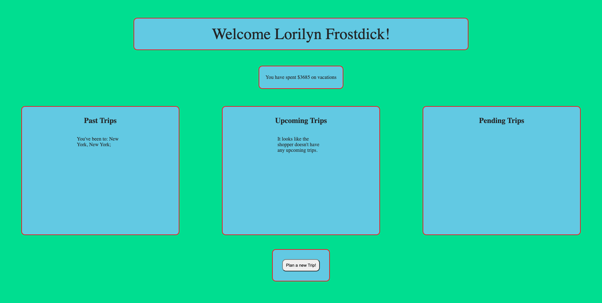
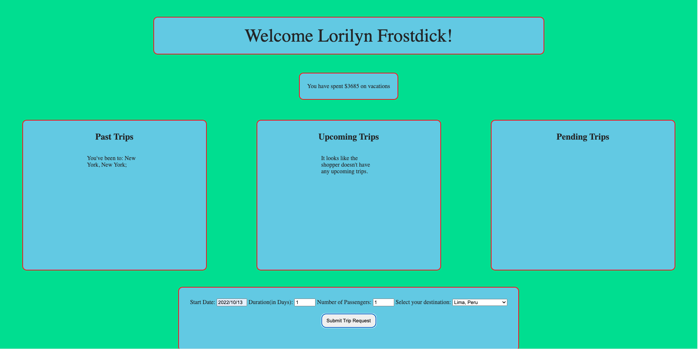
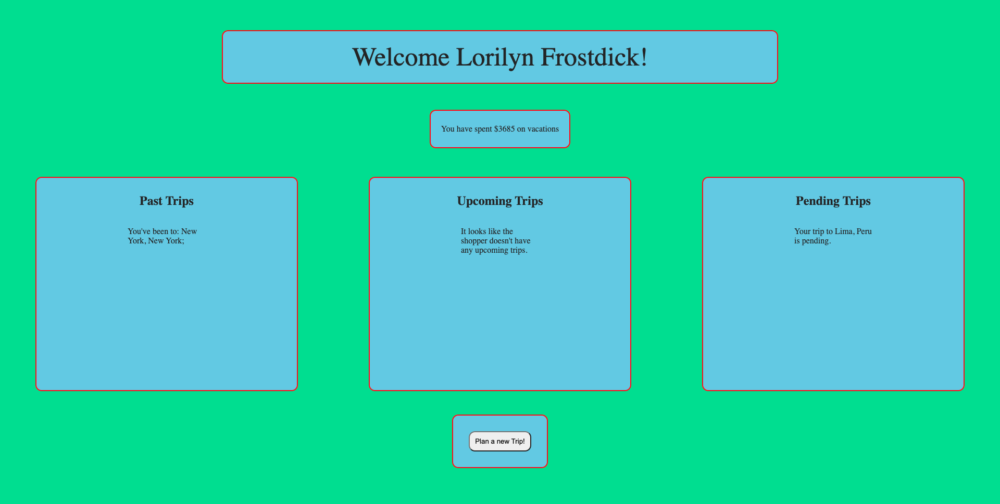

# Travel Tracker

### Mod2 2108 Final Project

## Table of Contents
- [Abstract](#Abstract)
- [Technologies](#Technologies)
- [Illustrations](#Illustrations)
- [Install](#Install)
- [Wins](#Wins)
- [Challenges](#Challenges)
- [Additions](#Additions)
- [Contributors](#Contributors)
- [Specs](#Specs)

## Abstract
Travel Tracker is an app that allows a user to log in and view their travel history. It will show how much money they've spent on vacations, past trips, current trips, and potential future trips. Users can also add trips to be approved by a travel agent.

## Technologies
-  HTML
-  CSS
-  JavaScript
-  Mocha/Chai
-  Webpack
-  Node.js
-  fetch API
-  SCSS/SASS
-  ESLint

## Illustrations

## Install

-  Clone this [repo](https://github.com/turingschool-examples/travel-tracker-api) to your machine
-  cd into the directory `travel-tracker-api`
-  Run `npm install`
-  Run `npm start`

-  Clone down this [repo](https://github.com/bpeterson2579/travel-tracker) to your machine
-  cd into the directory `travel-tracker`
-  Run `npm install` in the terminal
-  Run `npm start` in the terminal
-  In the browser go to `http://localhost:8080/`

## Wins
- I built this whole comp by myself. Holy cow
- I didn't have near the struggles with fetch and post that I did in the previous project.

## Challenges
- I struggled with getting some of the tests to pass.
- Having to match ids between trips and destinations always took longer than I expected it to.

## Future Iterations
- Fix random NaN for money spent with some users
- Add Travel agent functionality
- Ability to create a new user
- Finish incorporating SCSS

## Contributors
- [Brian Peterson](https://github.com/bpeterson2579)

## Specs
Project specs can be found here
-  [Travel Tracker](https://frontend.turing.edu/projects/travel-tracker.html)
